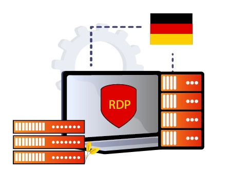

# Unlock Seamless Remote Access: Your Guide to German RDP Servers in 2025

Managing servers remotely or providing tech support across borders? You need a reliable Remote Desktop Protocol (RDP) server with full admin access. Whether you're troubleshooting client issues in Germany, accessing your main desktop from abroad, or managing web files from anywhere, the right German RDP provider makes all the difference. This guide breaks down the top 10 German RDP servers offering full administrative control, blazing speeds, and rock-solid security—without the tech jargon or flowery prose. Just straight talk about what works.

---

## What Are German RDP Servers?

Think of RDP as your digital bridge. Remote Desktop Protocol, developed by Microsoft, lets you connect to another computer over the internet as if you're sitting right in front of it. German RDP servers are simply these services hosted in Germany's data centers, offering lower latency for European users and compliance with local data regulations.

These servers are widely used for remote administration, accessing web resources, and managing client systems from anywhere in the world. The Germany location gives you EU data protection benefits and excellent connectivity across Europe.

## Top 10 German RDP Servers for 2025

Here's the lineup of RDP providers that deliver the goods—full admin access, solid uptime, and performance that won't make you want to throw your keyboard:

**Quick Reference:**

1. **Kamatera** - Overall best Germany RDP server
2. **YouStable** - Best German RDP provider for value
3. **QloudRDP** - Fast, flexible German solutions
4. **UltaHost** - 20X faster and cheaper
5. **ScalaHosting** - Affordable with great features
6. **Hosting.com** - Budget-friendly powerhouse
7. **Contabo** - Easy to use for beginners
8. **LiquidWeb** - Premium Windows RDP experience
9. **Vultr** - Cost-effective cloud solutions
10. **Cloudways** - Powerful managed RDP platform

### 1. Kamatera – Premium German RDP with Zero-Failure Infrastructure

Looking for enterprise-grade security with Cloud FireWall protection? Kamatera delivers high-performance RDP servers with a 30-day free trial—perfect for testing the waters without risk. Their centralized software management makes serving multiple clients from a remote desktop surprisingly simple.

With 18 data centers across 4 continents, including Germany, Kamatera boasts near-zero failure rates and a 99.95% uptime commitment. That's not marketing fluff—it's infrastructure you can count on.

**What You Get:**

🔶 24/7 support through LiveChat and ticketing for when things go sideways
🔶 Intel Xeon Gold/IceLake processors with minimum 2.7GHz CPU speed
🔶 Cloud FireWall protection against online nasties
🔶 Advanced networking features including virtual private networks
🔶 Daily backups and data recovery options
🔶 99.95% guaranteed uptime for round-the-clock data transfer
🔶 Reliable cloud load balancer for distributed workloads

👉 [Experience blazing-fast German RDP with enterprise-grade infrastructure—start your free trial with Kamatera today](https://www.vultr.com/?ref=9738262-9J)

### 2. YouStable – Best Value German RDP Provider

YouStable hits the sweet spot between affordability and performance. Their 99.9% uptime guarantee keeps your remote servers running 24/7, while Windows 2019/2022 Server and Pure SSD NVMe storage ensure smooth remote connections.

The 90-day risk-free trial gives newcomers plenty of time to get comfortable, and with at least 2-core processors and 4GB RAM, you'll experience minimal latency. Full admin access means you configure your server exactly how you need it.

**Key Features:**

🔶 Full administrative access to customize your server setup
🔶 LiteSpeed web servers for incredibly smooth remote experiences
🔶 Latest SSD NVMe storage tech for lightning-fast load times
🔶 Minimum 1TB bandwidth, 50GB NVMe SSD, and 4GB RAM
🔶 BitNinjaServer technology with enhanced security
🔶 Free user-friendly control panel (cPanel/DirectAdmin)
🔶 Comprehensive server monitoring for flawless connectivity
🔶 99.9% guaranteed uptime for uninterrupted data transfer
🔶 24/7 customer support via LiveChat, tickets, email, and phone
🔶 Advanced DDoS protection system

### 3. QloudRDP – Fast and Flexible German Solutions

QloudRDP Germany specializes in high-performance Remote Desktop servers tailored for professionals, businesses, and students. Strategically located in Germany's Tier 2 facilities, they offer ultra-low latency connections perfect for European users and beyond.

Whether you're an IT manager, forex trader, contractor, or graphic designer, QloudRDP servers are built to boost productivity with seamless remote system access.

**Standout Features:**

🔶 Lightning-fast connections with ultra-low latency for uninterrupted work
🔶 High-quality hardware including AMD EPYC processors and NVMe SSD storage
🔶 Advanced DDoS protection, encrypted connections, and 2FA authentication
🔶 Instant activation—server ready in under 60 seconds after payment
🔶 99.99% uptime guarantee ensuring 24/7 accessibility
🔶 Unlimited bandwidth for large file transfers without limits
🔶 Flexible pre-installed OS options including Windows and Linux

### 4. UltaHost – 20X Faster Performance at Lower Cost

UltaHost delivers up to 20X faster speeds with cheaper German RDP hosting. Flexible features, unlimited bandwidth, and exceptional performance at unbeatable prices—that's the UltaHost promise.

Their 99.99% guaranteed uptime, 24/7 power supply, and energy-efficient infrastructure ensure round-the-clock file transfers without failures.

**Core Features:**

🔶 Easy-to-use cPanel and managed server security for beginners
🔶 20X faster TurboSpeed technology for smooth remote desktop connections
🔶 Latest SSD NVMe storage for faster read/write speeds
🔶 Advanced DDoS protection software built-in
🔶 Zero downtime with JetPack security included
🔶 24/7 customer support via LiveChat and ticketing

### 5. ScalaHosting – Affordable German RDP with sPanel

ScalaHosting offers 20X TurboFast managed cloud German RDP hosting with their next-generation control panel (sPanel) for a seamless remote desktop experience. CloudFlare integration accelerates your RDP server while simplifying monitoring.

Their support responds in 30 seconds via LiveChat and 15 minutes through tickets—that's commitment to customer service.

**What Makes It Special:**

🔶 sPanel—next-generation all-in-one control panel for easy management
🔶 30-day money-back guarantee for risk-free testing
🔶 Fully managed RDP server with powerful caching and daily remote backups
🔶 Fast SSD NVMe storage for maximum server speed
🔶 OpenLiteSpeed web server making servers lightning-fast
🔶 24/7/365 customer service for purchase and configuration help
🔶 SShield security solution blocking 99.98% of web attacks

### 6. Hosting.com – Best Budget German RDP Server

Hosting.com, with servers delivering 20 times faster turbo speeds, provides high-performance RDP hosting in Germany. Famous for powerful processors, latest SSD NVMe storage, and more, they offer fully managed RDP service with easy-to-use cPanel.

Round-the-clock support through live chat and tickets ensures you're never stuck.

**Feature Highlights:**

🔶 Easy-to-use cPanel with managed server security
🔶 20X faster TurboSpeed technology
🔶 Latest SSD NVMe storage technology
🔶 Advanced DDoS protection software built-in
🔶 Zero downtime with JetPack security
🔶 24/7 customer service via LiveChat and tickets

### 7. Contabo – User-Friendly German RDP

Want Bare Metal RDP servers at affordable prices with 99.996% uptime commitment, 8+ worldwide data centers, and best price-performance ratio? Contabo delivers, along with 100+ web-connected apps and incredibly user-friendly cPanel.

**Why Choose Contabo:**

🔶 cPanel, Plesk, Docker, and WebMin for easy RDP server handling
🔶 Best operating systems (Ubuntu, Windows, CentOS, FreeBSD, Debian) available
🔶 Full root access for complete server control
🔶 99.996% highest guaranteed uptime (only 20 minutes 52 seconds downtime yearly)
🔶 Internal DDoS protection for data security
🔶 Fast and responsive AMD EPYC 7282 16-core processors
🔶 SSD or Gen 4 PCIe NVMe SSD for increased loading speeds
🔶 Incredibly powerful NVIDIA GeForce and Tesla GPUs available

### 8. LiquidWeb – Premium Windows RDP Experience

LiquidWeb offers 100% managed Next-Gen RDP service with 10Gbps networking for faster data transfer, latest processors, and top-notch SSD NVMe storage.

Integrated FireWall and standard DDoS protection secure and encrypt data transfer, protecting servers against malicious online threats.

**Feature Set:**

🔶 Cutting-edge next-generation SSD NVMe storage technology
🔶 Free daily backups for faster data recovery
🔶 Easy resource scaling up or down based on requirements
🔶 Free easy-to-use control panel with one-click setup
🔶 100% guaranteed power supply and highest uptime guarantee
🔶 24/7 customer service via live chat and ticketing
🔶 Standard DDoS attack protection
🔶 Full root access for complete server control

### 9. Vultr – Cost-Effective German Cloud RDP

Looking for RDP servers backed by SSD storage with RockSolid Security at affordable hourly rates? Check out Vultr's RDP hosting. Native DDoS and FireWall Protection secure servers against malicious threats, while Global Content Caching delivers impeccable data transfer speeds.

For those seeking reliable German RDP without breaking the bank, Vultr makes it happen. Their infrastructure spans multiple continents, with German data centers offering low-latency connections throughout Europe. The straightforward pricing model means no surprise charges—just transparent, predictable costs that scale with your needs.

**Core Features:**

🔶 Web Application Firewall (WAF), advanced DDoS protection, and malware protection
🔶 Latest Ultra SSD NVMe storage technology for faster data transfer
🔶 Attractive discount coupons and 30-day money-back guarantee
🔶 Excellent scalability—easily expand resources based on server requirements
🔶 User-friendly control panel for those with zero technical knowledge
🔶 24/7 customer service through live chat and ticketing
🔶 Full administrative access without restrictions

👉 [Deploy your German RDP server in minutes with Vultr's blazing-fast infrastructure and unbeatable pricing](https://www.vultr.com/?ref=9738262-9J)

### 10. Cloudways – Powerful Managed German RDP

Looking for fast, simple, and reliable cloud RDP hosting in Germany? Cloudways not only has data centers in Germany but also features advanced caching and Cloudflare (CDN) ensuring maximum server performance.

Cloudways delivers guaranteed 99.99% uptime with 10X faster server loading times.

**What Sets It Apart:**

🔶 New SSD NVMe drives offering revolutionary server performance
🔶 Built-in optimized advanced caching (Memcached, Varnish, Nginx, Redis)
🔶 Web Application Firewall and advanced DDoS protection
🔶 Scalable—easily scale VPS resources based on increased demand
🔶 Free cPanel and one-click setup for user-friendly hosting
🔶 24/7 real-time server monitoring
🔶 One-click backup feature for data recovery

## Key Features of the Best German RDP Servers

The top German RDP providers share several crucial characteristics that separate them from mediocre offerings:

**Security First:** Advanced DDoS protection, firewalls, and encrypted connections aren't optional extras—they're baseline requirements. The best providers build security into every layer of their infrastructure.

**Performance Matters:** NVMe SSD storage, powerful processors (Intel Xeon or AMD EPYC), and 10Gbps+ networking ensure your remote sessions feel responsive, not laggy.

**Uptime Guarantees:** Look for 99.9% or higher uptime commitments. Anything less means you'll face frustrating downtime when you need access most.

**Full Admin Access:** Without complete root/administrative control, you're stuck with someone else's configuration. The best providers give you the keys to customize everything.

**Scalability:** Your needs change. Good providers let you easily upgrade (or downgrade) resources without migrating to a new server.

**Support That Actually Helps:** 24/7 support sounds great until you realize you're talking to unhelpful bots. The providers listed here offer real human assistance when things go wrong.

## Top Recommendations for German RDP with Full Admin Access

If you're overwhelmed by choices, here's the shortlist:

**Kamatera:** Get a 30-day free trial with hour-by-hour billing, top-notch processors, load balancers, and FireWall protection for easy, smooth, and secure data transfer.

**YouStable:** 90-day free RDP trial, 99.9% uptime, Windows 2019/2022, minimum 1TB bandwidth, with full administrative access.

**UltaHost:** 30-day free trial, 99.99% uptime commitment, 24/7 server monitoring, powered by latest Intel Xeon Gold and Platinum processors with lightning-fast RAID10 storage.

**ScalaHosting:** Choose custom cloud resources, full root customization control, free instant server setup, scalable resources, 10Gbps redundant networking, and guaranteed performance.

## Frequently Asked Questions

**Who's the best RDP provider in Germany?**
YouStable, UltaHost, ScalaHosting, and Kamatera top the list. They offer free trials, top-notch security technology, latest storage systems, and daily backup plans for quick data recovery.

**Is RDP Server cheaper than Windows VPS?**
It depends on the resources you select based on requirements. However, basic Windows VPS plans are generally cheaper than RDP servers.

**How is German RDP hosting the best option for modern users?**
German RDP hosting lets users remotely control and manage physical desktops or servers. Here's why it's perfect for today's generation:

- Gamers can play PC-configured games from remote locations using smartphones and tablets
- Users can provide remote technical assistance or solve digital problems for clients located far away

**What's the use of German RDP?**
German RDP servers are useful for:
- Players use German RDP servers to browse games remotely
- Users can serve their German customers by providing technical assistance and troubleshooting

---

## Conclusion

You now have everything needed to choose a 100% reliable German RDP provider with full administrative access. We've covered the benefits of selecting top German RDP service providers and recommended the best top 4 life-changing German RDP servers.

Remote access doesn't have to be complicated or expensive. The right German RDP server gives you the control, performance, and reliability you need—whether you're managing client systems, accessing your desktop from abroad, or running resource-intensive applications remotely. The providers listed here have proven track records, solid infrastructure, and the features that matter most.

Pick one that fits your budget and requirements, take advantage of free trials where available, and get started with seamless remote access today.
